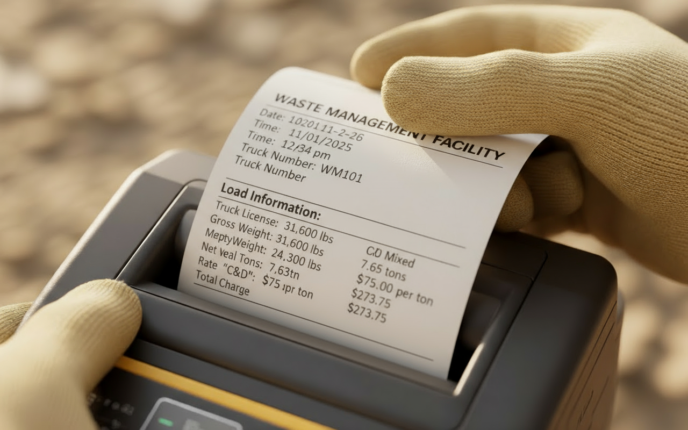
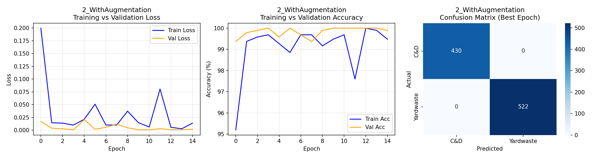
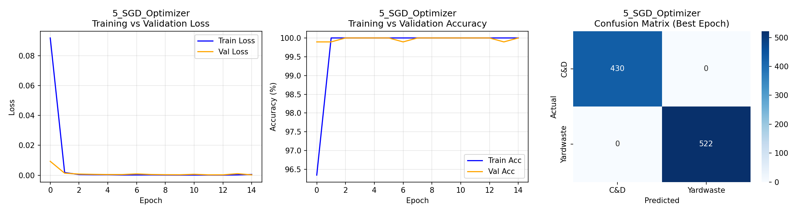

<div align="center">

<!-- Hero Section with Clean Logo -->


<br><br>

# MatID

### The AI Revolution in Waste Management

*Immediate, accurate material identification with full traceability.*

<br>

<!-- Quick Stats Highlight -->
🎯 **100% Accuracy** · 📊 **7 Experiments** · 🧠 **3 Architectures** · ⚡ **15 Epochs** 

<br>

<!-- Modernized Badge Row - Monochrome Theme -->
[](https://python.org)
[](https://pytorch.org)
[](https://colab.research.google.com)
[](https://wandb.ai)
[](/)
<br>

---
markdown| [Problem](#-the-problem) | [Solution](#-the-solution) | [Technical](#-technical-approach) | [Experiments](#-experiments) | [Results](#-results) | [Deliverables](#-deliverables) |
|:---:|:---:|:---:|:---:|:---:|:---:|

---

</div>

<br>

## 🌴 The Problem

<details open>
<summary><b>Click to expand</b></summary>

<br>

### Florida: Where Beauty Meets the Boom

To understand the waste crisis, follow the source. Florida operates at the intersection of two massive forces:

<br>

<table>
<tr>
<td width="50%">

<div align="center">

**🌿 The Standard of Beauty**


*Millions of tons of Yard Waste from daily maintenance.*

</div>

</td>
<td width="50%">

<div align="center">

**🏗️ The Construction Explosion**


*Massive C&D debris from rapid urban development.*

</div>

</td>
</tr>
</table>

<br>

> 💡 **The Result:** Landscape maintenance and rapid city development generate millions of tons of waste per year. This is where the problem begins.

<br>

---

### 🚛 The Convergence Point

Regardless of origin, all materials share the same destination: **Material Recovery Facilities (MRFs).** Thousands of haulers transport debris daily, creating a massive, mixed stream of incoming waste.

<br>

<div align="center">


*A typical MRF operation where trucks dump mixed loads for processing.*

</div>

<br>

### The Standard Process

| Step | Action |
|:----:|--------|
| **1** | Truck arrives at scale house, gets weighed |
| **2** | Driver declares material type, collects ticket |
| **3** | Truck proceeds to tipping floor |
| **4** | Material dumped based on declaration |
| **5** | Truck departs |

<br>

> ⚠️ **The Critical Flaw:** At no point is there reliable visual verification to ensure dumped material matches the driver's declaration.

<br>

---

### 💸 The Cost: $2.1 Billion Lost Annually

This verification gap creates a massive financial bleed across the U.S. waste industry.

<br>

<div align="center">

```
╔══════════════════════════════════════════════════════════════════╗
║                                                                  ║
║              U.S. MRF FINANCIAL LOSSES                           ║
║              ─────────────────────────                           ║
║                                                                  ║
║     ████████████████████████████████████████  $1.2B  (57%)       ║
║     Fraud & Misclassification                                    ║
║                                                                  ║
║     ████████████████████████                  $630M  (30%)       ║
║     Lack of Visual Proof                                         ║
║                                                                  ║
║     ████████                                  $210M  (10%)       ║
║     Contaminated Loads                                           ║
║                                                                  ║
║                                              ─────────           ║
║                                      TOTAL:  $2.1 BILLION        ║
║                                                                  ║
╚══════════════════════════════════════════════════════════════════╝
```

</div>

<br>

<details>
<summary><b>📊 Breakdown of Losses</b></summary>

<br>

| Category | Loss | Description |
|----------|------|-------------|
| **Fraud & Misclassification** | $1.2B | Attendants or managers modify material selections for cheaper rates—whether through collusion or human error |
| **Lack of Visual Proof** | $630M | No photo evidence when clients dispute bills, forcing facilities to issue refunds |
| **Contaminated Loads** | $210M | Misidentified loads trigger reprocessing costs and equipment damage (e.g., steel hidden in wood) |

</details>

</details>

<br>

---

## 💡 The Solution

<details open>
<summary><b>Click to expand</b></summary>

<br>

<div align="center">

# MatID App

### Accuracy. Speed. Trust.

*At the Tipping Floor.*

</div>

<br>

MatID isn't just a model—it's an operational tool. By deploying AI on rugged tablets, we identify exact materials with **>99% accuracy**.

This eliminates billing disputes instantly and gives plant managers clean, trustworthy data for smart, data-driven decisions.

<br>

### 📲 The Workflow

<br>

<table>
<tr>
<td align="center" width="25%">


**Step 1**

*Truck Arrival & Weigh-in*

</td>
<td align="center" width="25%">


**Step 2**

*Dumping Material*

</td>
<td align="center" width="25%">


**Step 3**

*AI Material Scan*

</td>
<td align="center" width="25%">



**Step 4**

*Ticket Prints*

</td>
</tr>
</table>

<br>

### Key Benefits

| | Benefit | Impact |
|:-:|---------|--------|
| 🚀 | **Increased Turnaround** | Entire process streamlined to under 5 minutes |
| 📸 | **Irrefutable Visual Proof** | Every ticket includes timestamped photo |
| 🚫 | **Fraud Prevention** | AI eliminates human error and misclassification |

</details>

<br>

---

## 🧠 Technical Approach

<details>
<summary><b>Click to expand</b></summary>

<br>

### Modified AlexNet Architecture

We leverage **transfer learning** with a pre-trained AlexNet model (trained on ImageNet) and adapt it for binary waste classification. The key modification is replacing the final fully connected layer to output 2 classes instead of 1,000.

<br>

<div align="center">

```
┌─────────────────────────────────────────────────────────────────────────────┐
│                        ALEXNET ARCHITECTURE                                 │
│                     (Modified for Waste Classification)                     │
├─────────────────────────────────────────────────────────────────────────────┤
│                                                                             │
│   INPUT                                                                     │
│   224 × 224 × 3                                                             │
│        │                                                                    │
│        ▼                                                                    │
│   ┌─────────────────────────────────────────────────────────────────────┐   │
│   │                    FEATURE EXTRACTION                               │   │
│   ├─────────────────────────────────────────────────────────────────────┤   │
│   │  Conv1 → ReLU → MaxPool   (96 filters, 11×11, stride 4)            │   │
│   │  Conv2 → ReLU → MaxPool   (256 filters, 5×5)                       │   │
│   │  Conv3 → ReLU             (384 filters, 3×3)                       │   │
│   │  Conv4 → ReLU             (384 filters, 3×3)                       │   │
│   │  Conv5 → ReLU → MaxPool   (256 filters, 3×3)                       │   │
│   └─────────────────────────────────────────────────────────────────────┘   │
│        │                                                                    │
│        ▼                                                                    │
│   ┌─────────────────────────────────────────────────────────────────────┐   │
│   │                       CLASSIFIER                                    │   │
│   ├─────────────────────────────────────────────────────────────────────┤   │
│   │  Flatten → Dropout(0.5)                                            │   │
│   │  FC1: 9216 → 4096 → ReLU → Dropout(0.5)                            │   │
│   │  FC2: 4096 → 4096 → ReLU → Dropout(0.5)                            │   │
│   │  FC3: 4096 → 2  ← MODIFIED (originally 1000 for ImageNet)          │   │
│   └─────────────────────────────────────────────────────────────────────┘   │
│        │                                                                    │
│        ▼                                                                    │
│   OUTPUT                                                                    │
│   [C&D, Yardwaste]                                                          │
│                                                                             │
└─────────────────────────────────────────────────────────────────────────────┘
```

</div>

<br>

### Dataset & Preprocessing

Our dataset consists of real-world images from Material Recovery Facilities, split into two classes:

| Class | Description | Train | Validation |
|-------|-------------|:-----:|:----------:|
| **C&D** | Construction & Demolition debris | — | 430 |
| **Yardwaste** | Organic landscape materials | — | 522 |

**Total validation samples:** 952 images

<br>

**Preprocessing Pipeline:**

All images undergo the following transformations before being fed into the model:

```python
# Standard preprocessing (no augmentation)
transforms = [
    Resize(224, 224),                                    # Resize to AlexNet input
    Normalize(mean=[0.485, 0.456, 0.406],               # ImageNet normalization
              std=[0.229, 0.224, 0.225]),
    ToTensor()
]
```

<br>

**Data Augmentation** (applied in select experiments):

```python
# Augmentation transforms
augmentations = [
    HorizontalFlip(p=0.5),
    VerticalFlip(p=0.2),
    RandomRotate90(p=0.5),
    RandomBrightnessContrast(brightness=0.2, contrast=0.2, p=0.3),
    ShiftScaleRotate(shift=0.1, scale=0.1, rotate=15, p=0.3)
]
```

<br>

### Training Configuration

<div align="center">

| Parameter | Value |
|-----------|-------|
| **Framework** | PyTorch |
| **Pre-trained Weights** | ImageNet1K_V1 |
| **Loss Function** | CrossEntropyLoss |
| **Primary Optimizer** | Adam |
| **Epochs** | 15 |
| **Hardware** | Google Colab T4 GPU |
| **Tracking** | Weights & Biases |

</div>

<br>

### Experimental Variables

To understand model behavior, we systematically varied the following hyperparameters:

| Variable | Values Tested |
|----------|---------------|
| **Batch Size** | 16, 64 |
| **Learning Rate** | 0.0001, 0.001 |
| **Optimizer** | Adam, SGD (momentum=0.9) |
| **Data Augmentation** | On, Off |
| **Architecture** | AlexNet, VGG16, ResNet18 |

<br>

### Alternative Architectures

In addition to AlexNet, we compared performance against two other CNN architectures:

<br>

<table>
<tr>
<td width="33%" align="center">

**AlexNet**

*8 layers · 61M params*

The baseline. Fast training, lightweight architecture with 5 convolutional layers.

</td>
<td width="33%" align="center">

**VGG16**

*16 layers · 138M params*

Deeper network with uniform 3×3 convolutions. More parameters, slower training.

</td>
<td width="33%" align="center">

**ResNet18**

*18 layers · 11M params*

Skip connections enable better gradient flow. Efficient despite depth.

</td>
</tr>
</table>

<br>

All architectures were modified identically—replacing only the final classification layer to output 2 classes:

```python
# AlexNet & VGG16
model.classifier[6] = nn.Linear(4096, 2)

# ResNet18
model.fc = nn.Linear(512, 2)
```

</details>

<br>

---

## 🧪 Experiments

<details>
<summary><b>Click to expand</b></summary>

<br>

We conducted **7 systematic experiments** to understand how different hyperparameters and architectures affect model performance on waste classification.

<br>

### Experiment Overview

| # | Experiment | Model | Batch Size | Learning Rate | Optimizer | Augmentation |
|:-:|------------|-------|:----------:|:-------------:|:---------:|:------------:|
| 1 | Baseline | AlexNet | 16 | 0.0001 | Adam | ❌ |
| 2 | With Augmentation | AlexNet | 16 | 0.0001 | Adam | ✅ |
| 3 | Batch Size 64 | AlexNet | 64 | 0.0001 | Adam | ❌ |
| 4 | Higher LR | AlexNet | 16 | 0.001 | Adam | ❌ |
| 5 | SGD Optimizer | AlexNet | 16 | 0.001 | SGD | ❌ |
| 6 | VGG16 | VGG16 | 16 | 0.0001 | Adam | ❌ |
| 7 | ResNet18 | ResNet18 | 16 | 0.0001 | Adam | ❌ |

<br>

### Experiment Details

<details>
<summary><b>Exp 1: Baseline AlexNet</b></summary>

<br>

The baseline configuration using AlexNet with default hyperparameters.


**Key Observations:**
- Achieved **100% validation accuracy** by epoch 2
- Rapid convergence with stable training
- Training and validation curves align closely (no overfitting)

</details>

<details>
<summary><b>Exp 2: With Data Augmentation</b></summary>

<br>

Testing the effect of data augmentation (flips, rotations, brightness/contrast adjustments).



**Key Observations:**
- Peak accuracy: **100%** (achieved multiple times)
- More variance in training due to augmentation
- Final accuracy: 99.89% — slight fluctuation is normal with augmentation

</details>

<details>
<summary><b>Exp 3: Larger Batch Size (64)</b></summary>

<br>

Comparing batch size 16 vs 64 to understand the effect on convergence.


**Key Observations:**
- Achieved **100% validation accuracy** by epoch 3
- Slightly slower initial convergence than batch size 16
- Stable training with no overfitting

</details>

<details>
<summary><b>Exp 4: Higher Learning Rate (0.001)</b></summary>

<br>

Testing a 10× higher learning rate to understand stability limits.


**Key Observations:**
- ⚠️ **Unstable training** — high variance in both loss and accuracy
- Peak accuracy: **99.47%** (epoch 5 and 9)
- Collapsed to **54.83%** by final epoch
- **Not recommended** — classic example of learning rate being too aggressive

</details>

<details>
<summary><b>Exp 5: SGD Optimizer</b></summary>

<br>

Comparing Adam vs SGD with momentum (0.9).



**Key Observations:**
- Achieved **100% validation accuracy** by epoch 3
- SGD handled higher learning rate (0.001) better than Adam
- Clean, stable convergence throughout training

</details>

<details>
<summary><b>Exp 6: VGG16 Architecture</b></summary>

<br>

Testing a deeper architecture (16 layers vs AlexNet's 8).


**Key Observations:**
- Achieved **100% validation accuracy** by epoch 2
- Similar convergence pattern to AlexNet
- More parameters but no accuracy improvement over baseline

</details>

<details>
<summary><b>Exp 7: ResNet18 Architecture</b></summary>

<br>

Testing ResNet18 with skip connections.


**Key Observations:**
- 🏆 **100% validation accuracy from epoch 1** — best performer
- Fastest convergence of all experiments
- Skip connections enable efficient gradient flow
- Fewest parameters (11M) among the three architectures

</details>

</details>

<br>

---

## 📊 Results

<details open>
<summary><b>Click to expand</b></summary>

<br>

### Summary Table

| # | Experiment | Best Val Accuracy | Final Val Accuracy | Stability |
|:-:|------------|:-----------------:|:------------------:|:---------:|
| 1 | Baseline AlexNet |  | 100.00% | ✅ Stable |
| 2 | With Augmentation |  | 99.89% | ⚡ Variable |
| 3 | Batch Size 64 |  | 100.00% | ✅ Stable |
| 4 | Higher LR (0.001) |  | 54.83% | ❌ Collapsed |
| 5 | SGD Optimizer |  | 100.00% | ✅ Stable |
| 6 | VGG16 |  | 100.00% | ✅ Stable |
| 7 | ResNet18 |  | 100.00% | ✅ Stable |

<br>

### Key Findings

<br>

**1. Learning Rate Sensitivity**

The most impactful hyperparameter was learning rate. At 0.001 with Adam, training became unstable and eventually collapsed. The conservative 0.0001 rate produced consistent, stable convergence across all experiments.

<br>

**2. Architecture Comparison**

All three architectures achieved 100% accuracy, but with different characteristics:

| Architecture | Parameters | Epochs to 100% | Recommendation |
|--------------|:----------:|:--------------:|----------------|
| **AlexNet** | 61M | 2 | Good baseline |
| **VGG16** | 138M | 2 | Overkill for this task |
| **ResNet18** | 11M | **1** | 🏆 Best for deployment |

**ResNet18** is the recommended choice—fewest parameters, fastest convergence, and perfect accuracy from the first epoch.

<br>

**3. Data Augmentation**

Augmentation did not improve peak accuracy (already at 100%) but introduced training variance. For this well-separated dataset, augmentation provides regularization that wasn't necessary.

<br>

**4. Batch Size Effect**

Batch size 64 converged one epoch slower than 16 due to fewer gradient updates per epoch, but both achieved the same final accuracy.

<br>

**5. Optimizer Comparison**

SGD with momentum handled the higher learning rate (0.001) significantly better than Adam, maintaining stable convergence where Adam collapsed.

<br>

### Confusion Matrix (Best Models)

All experiments (except Exp 4) achieved **perfect classification** on the validation set:

```
                 Predicted
              C&D    Yardwaste
Actual  C&D   430        0
   Yardwaste    0      522
```

**Total validation samples:** 952 (430 C&D + 522 Yardwaste)

<br>

### 🏆 Production Recommendation

Based on our experiments, the optimal configuration for deployment is:

| Parameter | Recommended Value |
|-----------|-------------------|
| **Architecture** | ResNet18 |
| **Learning Rate** | 0.0001 |
| **Batch Size** | 16 |
| **Optimizer** | Adam |
| **Augmentation** | Optional |

This configuration provides the best balance of accuracy, training speed, and model efficiency.

<br>

### 📈 Weights & Biases Dashboard

View the full interactive experiment tracking:

[](https://wandb.ai/niconv13-florida-atlantic-university/MatID-Waste-Classification)

</details>

<br>

---

## 📂 Deliverables

<details open>
<summary><b>Click to expand</b></summary>

<br>

<div align="center">

| Deliverable | Link | Description |
|-------------|:----:|-------------|
| 📊 **Google Slides** | [View Presentation](#) | Problem overview + AlexNet explanation |
| 💻 **Colab Notebook** | [Open in Colab](#) | Full implementation + all 7 experiments |
| 🖼️ **Scientific Poster** | [View Poster](#) | Academic poster summarizing results |
| 🎥 **Presentation Video** | [Watch Video](#) | 3-8 minute project walkthrough |
| 📈 **W&B Dashboard** | [View Dashboard](https://wandb.ai/niconv13-florida-atlantic-university/MatID-Waste-Classification) | Interactive experiment tracking |

</div>

</details>

<br>

---

<div align="center">

<br>

### 👤 About the Author

**Nicolas Navarro** · Data Science & Analytics · Florida Atlantic University

[](https://github.com/niconv13)
[](https://www.linkedin.com/in/nicolas-navarro-36971a295)
<br>

---

*MatID Final Project · MAP 2192 · Dr. Hahn · Fall 2025*

The AI Revolution in Waste Management

<br>

</div>
