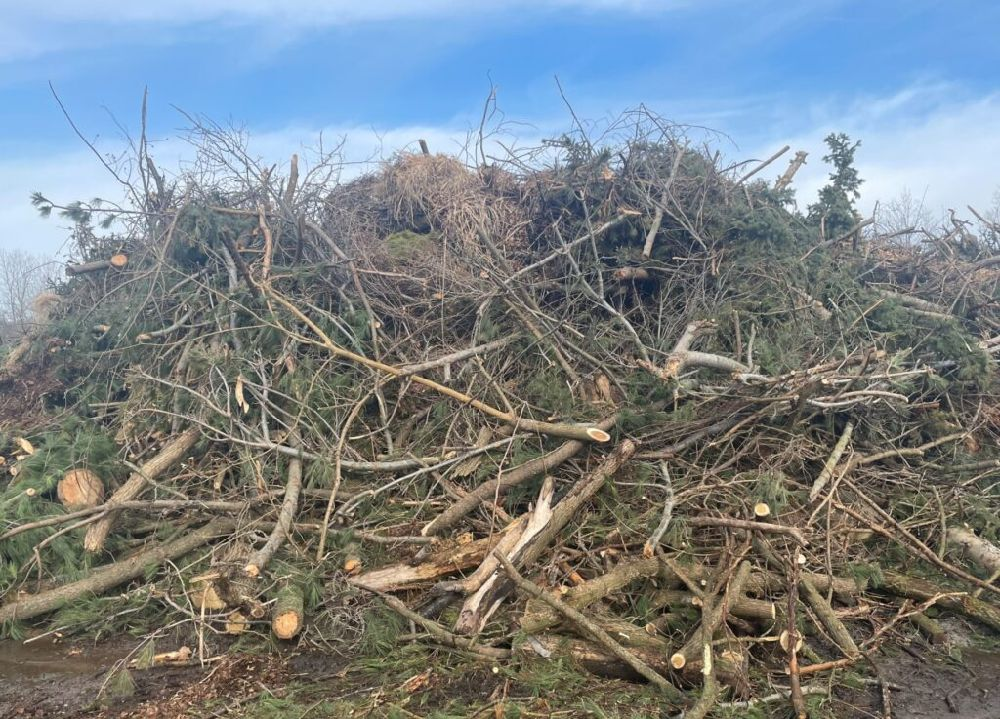

  
  
  <h1>The AI Revolution in Waste Management</h1>
  <h3>Immediate, accurate material identification with full traceability.</h3>

  

    
    
    
    
    
  

 

## 📑 Navigation
Use these links to jump to specific sections of the project:

1. [🔴 **The Problem & Motivation**](#-1-problem--motivation-the-florida-context)
2. [🧠 **Technical Approach (AlexNet)**](#-2-technical-approach-modified-alexnet)
3. [🧪 **Experiments & Methodology**](#-3-experimental-methodology)
4. [📊 **Results & Visualizations**](#-4-results--visualizations)
5. [📂 **Project Deliverables**](#-5-project-deliverables-resources)

---

## 🚜 1. Problem & Motivation: The Waste Industry Challenge
**Handling Massive, Mixed Waste Streams**

The waste management industry faces a critical bottleneck at the facility gate. Two distinct, high-volume waste streams are constantly entering facilities, often mixed in the same truck:

1.  **Construction & Demolition (C&D):** Concrete, lumber, and debris from rapid urban development and infrastructure projects.
2.  **Yard Waste (Vegetative):** Organic material from constant landscaping maintenance.

**The Operational Gap:**
Currently, identifying the ratio of these materials relies on human estimation. This manual process is subjective, slow, and prone to error, leading to:

* **📉 Revenue Leakage:** Inaccurate tipping fees due to poor volume estimation.
* **⚠️ Cross-Contamination:** Organic waste hiding in concrete loads renders recyclable materials useless.
* **🚫 Lack of Traceability:** No digital record or visual proof to verify loads with clients.

**MatID** addresses this operational inefficiency by deploying automated Computer Vision at the weigh station to classify incoming loads with precision.

### 📸 The Dataset: Distinguishing Similar Textures
Our model was trained on real-world samples to solve the visual ambiguity between dirty construction wood and organic branches.

| Class A: Construction (C&D) | Class B: Yard Waste |
| :---: | :---: |
|  |  |
| *High-density debris: Concrete, Rebar, Lumber.* | *Organic material: Branches, Grass, Stumps.* |
