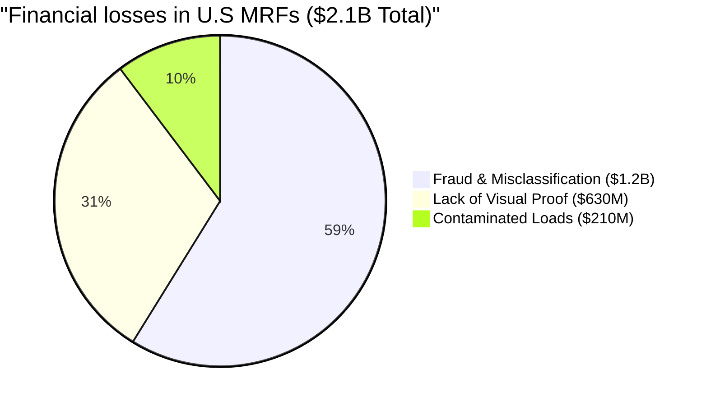

  
  
  <h1>The AI Revolution in Waste Management</h1>
  <h3>Immediate, accurate material identification with full traceability.</h3>

  

    
    
    
    
    
  

 

## 📑 Navigation
Use these links to jump to specific sections of the project:

1. [🔴 **The Problem & Motivation**](#-1-problem--motivation-the-florida-context)
2. [🧠 **Technical Approach (AlexNet)**](#-2-technical-approach-modified-alexnet)
3. [🧪 **Experiments & Methodology**](#-3-experimental-methodology)
4. [📊 **Results & Visualizations**](#-4-results--visualizations)
5. [📂 **Project Deliverables**](#-5-project-deliverables-resources)

---

## 🌴 1. Problem & Motivation

### The Florida Context: Beauty & Boom
To understand the waste problem, we must look at the source. Florida is defined by two massive forces:

  <table>
    <tr>
      <td align="center">
        
         
        <b>The Standard of Beauty</b> 
        <i>Millions of tons of Yard Waste from daily maintenance.</i>
      </td>
      <td align="center">
        
         
        <b>The Construction Explosion</b> 
        <i>Massive C&D debris from rapid urban development.</i>
      </td>
    </tr>
  </table>

> **The Result:** Landscape maintenance and rapid city development generate millions of tons of waste per year. **This is where the problem begins.**

---
### 🚛 From Source to Facility: The Convergence
Regardless of the source, these materials share the same destination: **Material Recovery Facilities (MRFs).** Thousands of haulers transport this debris to MRFs daily, creating a massive, mixed stream of incoming waste.

### 🏭 The MRF Workflow: A Typical Process
Understanding how these facilities operate is key to seeing the problem.

  
   
  <i>A typical MRF operation where trucks dump mixed loads for processing.</i>

The standard process:

1.  **Truck Arrival & Weigh-in:** The truck arrives at the scale house, gets weighed, and the driver declares the material type to collect a ticket.
2.  **Dumping & Departure:** The truck proceeds to the tipping floor, dumps its material (into piles for either C&D or Yard Waste based on the declaration), and leaves.

> **The Critical Flaw:** At no point is there a reliable visual verification to ensure the dumped material matches the driver's declaration.

---
### 💸 The Consequence: A $2.1 Billion Annual Loss
This lack of verification and material identification creates a massive financial bleed across the U.S. waste industry.

The industry loses an estimated **$2.1 Billion annually** due to three main factors:

1.  **Fraud & Misclassification ($1.2B):** This happens both inside the truck and the **Scale House**. Attendants or managers can manually modify material selections to declare cheaper rates, whether due to deliberate manipulation (collusion) or simple **human error**.
2.  **Lack of Visual Proof ($630M):** When clients dispute a bill, the facility has no photo evidence to prove what was actually dumped, forcing them to issue refunds.
3.  **Contaminated Loads ($210M):** When a load is not properly identified, it triggers a chain reaction of costs. Contaminated material often requires **reprocessing** (sorting the same pile twice), drastically increasing **operational costs**. Furthermore, wrong materials (like steel hiding in wood) cause severe **equipment damage**, leading to expensive repairs and downtime.
   
#### The $2.1 Billion Financial Bleed Breakdown
This lack of visual verification costs U.S. recycling plants an estimated **$2.1 Billion every year**.

---

## 💡 2. The Solution: MatID App
**Accuracy, Speed, and Trust at the Tipping Floor**

MatID is not just a model; it is an operational tool. By deploying our AI on rugged tablets, we identify the exact material trucks bring into the plant with **>99% accuracy**.

This eliminates billing disputes instantly and gives plant managers clean, trustworthy data so they can finally make smart, data-driven decisions.

### 📲 The Workflow: Streamlined Operation
We optimized the dumping cycle to ensure speed and compliance.

  <table>
    <tr>
      <td align="center" width="300">
        
         
        <b>Step 1: Truck Arrival & Weigh-in</b> 
        <i>Truck arrives at the scale house and weights in.</i>
      </td>
      <td align="center" width="300">
        
         
        <b>Step 2: Dumping Material</b> 
        <i>Truck dumps material onto the designated area.</i>
      </td>
    </tr>
    <tr>
      <td align="center" width="300">
        
         
        <b>Step 3: AI Material Scan</b> 
        <i>Spotter captures images with tablet using MatID app.</i>
      </td>
      <td align="center" width="300">
        
         
        <b>Step 4: Ticket Prints</b> 
        <i>Mobile belt printer issues ticket instantly.</i>
      </td>
    </tr>
  </table>

### 🛡️ Key Operational Benefits
* **🚀 Increased Turnaround:** By removing manual inspection delays, the entire process is streamlined to under 5 minutes.
* **📸 Irrefutable Visual Proof:** Every ticket includes a **timestamped photo** to prevent disputes.
* **🚫 Fraud Prevention:** The AI eliminates human error and intentional misclassification at the point of service.

> **Technical Note:** The app runs a quantized version of our **AlexNet** model directly on edge devices (iPad), requiring no internet connection for inference.

---
